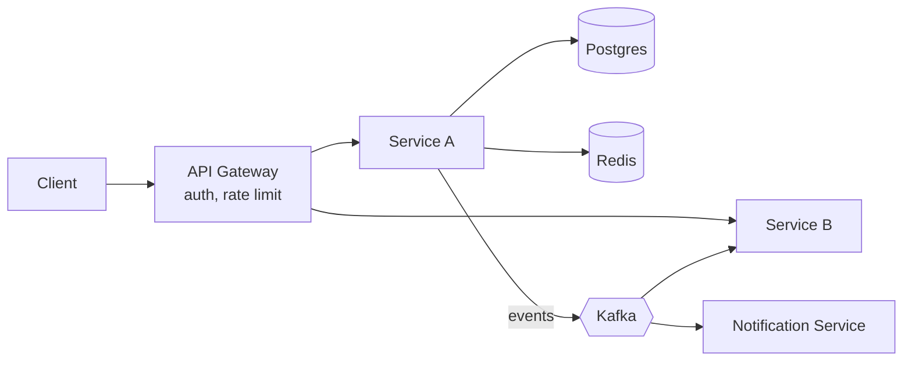

# HLD: <System>

> Fill live during the HLD half. Bullets only, since you talk over this; nobody reads it.
> Preview Mermaid in IntelliJ (Settings → Languages & Frameworks → Markdown → enable Mermaid)
> or paste into mermaid.live.

## 1. Requirements (5 min)
- Functional (3-5, the ones the LLD already implements first):
- Out of scope (say it out loud):
- Non-functional, with numbers: DAU, peak QPS, p99 latency, availability, consistency need
  (which data must be strongly consistent, and which can be eventually consistent)

## 2. Back-of-envelope (3 min)
- Writes/sec at peak = DAU × actions/day ÷ 86,400 × peak factor (3-5×)
- Reads/sec = writes × read:write ratio
- Storage/year = writes/day × record size × 365
- What this rules in or out (e.g. "5k writes/s fits one Postgres primary; 50k needs sharding")

## 3. LLD → services
| LLD class / aggregate | Service | Owns (data) | Talks to |
|---|---|---|---|
| | | | |

## 4. APIs (only the critical ones)
- `POST /...` → request, response, idempotency key?
- `GET /...` → pagination, cache?

## 5. Data
| Service | Store | Why this store | Access pattern | Indexes | Partition/shard key |
|---|---|---|---|---|---|
| | Postgres | transactions, constraints, row locks | | | |
| | Redis | hot reads, TTL holds, counters, locks | | | |
| | DynamoDB/Cassandra | huge write volume, key-value access | | | |
| | Elasticsearch | text/geo search, faceting | | | |

## 6. Architecture


## 7. The contended flow
```mermaid
sequenceDiagram
    participant U as User
    participant A as Service A
    participant DB as Postgres
    participant K as Kafka
    U->>A: request (Idempotency-Key)
    A->>DB: BEGIN; SELECT ... FOR UPDATE / conditional UPDATE
    DB-->>A: ok / conflict
    A->>DB: write + outbox row; COMMIT
    A-->>U: 201 / 409
    Note over A,K: outbox relay publishes to Kafka (at-least-once)
```

## 8. Deep dives (pick the 2 the interviewer cares about)
- **Concurrency.** LLD mechanism → distributed equivalent:
  CAS → conditional write / `@Version` optimistic column;
  per-key lock → `SELECT ... FOR UPDATE` (or `SKIP LOCKED` for queues) / Redis `SET NX PX` + fencing token;
  `putIfAbsent` uniqueness → unique constraint.
- **Async / Kafka.** Topic, partition key (ordering per what?), consumer group, at-least-once +
  idempotent consumer (dedupe table / natural key), DLQ + retry with backoff, outbox for
  DB+event atomicity.
- **Caching.** What is cached, key, TTL, invalidation (cache-aside + delete on write),
  stampede protection (single-flight per node, stale-while-revalidate, jittered TTLs).
- **Idempotency and retries.** Idempotency key on every mutating API (table written in the same
  txn); retries with exponential backoff + jitter for transient errors only; pass the key downstream
  (payment gateway) so their retries are safe too.
- **Holds.** TTL per resource (Redis `SET NX PX`, or `held_until` column); final booking re-checks the
  hold inside the DB txn; charge outside locks and refund on expiry.
- **Real-time (chat, live tracking).** Stateful WebSocket gateway tier behind an L4 LB;
  Redis `presence:{user}` → gateway node set with TTL refreshed by heartbeat; route messages to the
  user's node via Redis pub/sub or a per-node Kafka topic; offline → persist + unread counter +
  mobile push (FCM/APNs); reconnect → client syncs from its last message id; large channels use
  fan-out on read.
- **Scaling.** Stateless services behind LB; read replicas; shard key choice and hot-key risk;
  indexes for each query in §5.
- **Failure modes.** Which dependency down → what degrades; retries + timeouts + circuit
  breaker; reconciliation job for money/state drift.

## 9. Trade-offs I made / next steps
-
